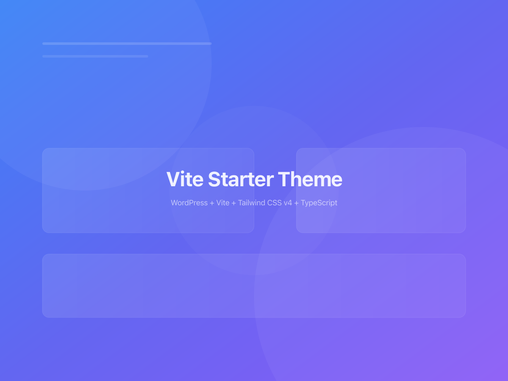

# Vite Starter Theme



A modern WordPress theme that leverages Vite for asset bundling, Tailwind CSS v4 for styling, and TypeScript for scripts. Includes PHPStan and PHPCS for code quality out of the box.

## Features

- **Vite Integration** - Lightning-fast HMR and optimized builds
- **Tailwind CSS v4** - Latest Tailwind with native CSS layer support
- **TypeScript** - Type-safe scripts with strict mode enabled
- **PHPStan Level 5** - Static analysis with WordPress-aware rules
- **PHPCS + WPCS** - WordPress coding standards enforcement
- **Modular Architecture** - Organized file structure with clear separation of concerns
- **Dual-Mode Asset Loading** - Automatic switching between dev and production
- **WordPress Cleanup** - Removes unnecessary WordPress bloat
- **Optimized Assets** - Automatic image optimization and asset hashing

## Installation

1. Clone the repository into your WordPress `wp-content/themes` directory.
2. Navigate to the theme directory and install dependencies:
    ```sh
    npm install
    composer install
    ```
3. Run the setup script to configure your theme:
    ```sh
    npm run setup
    ```
4. Build the assets:
    ```sh
    npm run build
    ```
5. Activate the theme from the WordPress admin panel.

## Setup Script

Running `npm run setup` launches an interactive script that personalizes the starter theme for your project. It will:

1. **Collect your theme info** — name, description, author, and author URL. A text domain and slug are derived automatically from the name in kebab-case.
2. **Apply replacements across the codebase** — updates the `style.css` header, `package.json` name, `README.md` title, welcome page heading, and asset handle prefixes in `inc/assets.php`.
3. **Swap the default font** — optionally replaces Roboto with any [fontsource](https://fontsource.org) font. Uninstalls the old package, installs the new one, and updates both the import and `font-family` rule in `fonts.css`.
4. **Remove the welcome page** — optionally deletes the demo welcome page and resets the index template to a blank starting point.
5. **Clean up after itself** — optionally deletes `setup.js` and removes the `setup` script from `package.json`.

See an example of a theme created with the setup script: [vite-starter-theme-example](https://github.com/Etyamor/vite-starter-theme-example)

## Development

Start the development server with hot module replacement:

```sh
npm run dev
```

This will:
- Start Vite dev server on `http://localhost:5173`
- Enable hot module replacement (HMR)
- Remove the manifest file to activate dev mode

Build for production:

```sh
npm run build
```

This creates optimized assets in the `dist/` directory with hashed filenames.

## Code Quality

All linting commands are available as npm scripts:

| Command | Description |
|---|---|
| `npm run lint` | Run PHPCS and PHPStan together |
| `npm run lint:php` | Check PHP code against WordPress coding standards |
| `npm run lint:php:fix` | Auto-fix PHPCS violations where possible |
| `npm run lint:types` | Run PHPStan static analysis (level 5) |
| `npm run typecheck` | Run TypeScript type checking |

### PHPStan

Static analysis is configured at level 5 with the [phpstan-wordpress](https://github.com/szepeviktor/phpstan-wordpress) extension, which understands WordPress hooks, functions, and globals.

Configuration: `phpstan.neon`

### PHPCS

Code style is enforced using the [WordPress Coding Standards](https://github.com/WordPress/WordPress-Coding-Standards) ruleset with PHP compatibility checks.

Configuration: `phpcs.xml`

### TypeScript

Scripts use TypeScript with strict mode. The entry point is `resources/scripts/scripts.ts`. Vite handles transpilation — no extra build step needed.

Configuration: `tsconfig.json`

## Project Structure

```
theme-root/
├── functions.php              # Lightweight loader
├── header.php                 # Template wrapper
├── footer.php                 # Template wrapper
├── index.php                  # Template wrapper
├── style.css                  # Theme metadata
├── composer.json              # PHP dependencies (PHPStan, PHPCS)
├── tsconfig.json              # TypeScript configuration
├── phpstan.neon               # PHPStan configuration
├── phpcs.xml                  # PHPCS configuration
├── vite.config.mjs            # Vite configuration
├── inc/
│   ├── assets.php             # Vite asset loading (dev + production)
│   └── cleanup.php            # WordPress cleanup hooks
├── template-parts/
│   ├── header.php             # Actual header template
│   ├── footer.php             # Actual footer template
│   └── index.php              # Actual index template
└── resources/
    ├── scripts/               # TypeScript source files
    ├── styles/                # CSS source files
    ├── images/                # Image assets
    └── fonts/                 # Font files (optional)
```

## Adding Fonts

Install a fontsource package:

```sh
npm install --save @fontsource/<font-family>
```

Import in `resources/styles/fonts.css`:

```css
@import '@fontsource/<font-family>';
```

## Adding Images

Reference images in CSS using relative paths:

```css
.hero {
    background-image: url('../images/hero.webp');
}
```

Vite will automatically process and optimize them during build.

## Important Notes

- **Vite does not parse PHP files** for assets. Assets must be imported in CSS/JS entry points to be bundled.
- The theme automatically detects dev vs production mode based on manifest file existence.
- All templates are in `template-parts/` for better organization.

## License

GPL-2.0-or-later
